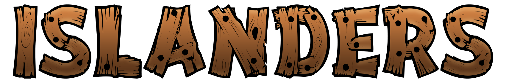

# Islanders frontend

## A projekt indításához szükséges a backend rész, ami egy másik repositoryban érhető el.

[Backend repository elérése](https://github.com/LeknerNorbert/Islands)

## A projekt indítása

Először végezzük el a backend repository-jában leírtakat (adatbázis elkészítése, backend elindítása).

Másodszor terminálban (akár vs code-ban megnyitás után, akár mappából cmd-vel) indítsuk el az alábbi parancsot:
### `npm install`

Miután feltelepültek a package-k indítsuk el a projektet az alábbi paranccsal:
### `npm start`

Ezzel elindul a frontend része egy új böngésző ablakban. 

Amennyiben nem nyílik meg új ablak az alábbit írja be a böngésző sávjába:
[http://localhost:3000](http://localhost:3000)

## A projekt firebase által deploy-olva lett az alábbi elérhetőségen:

[https://islanders-b7706.web.app/](https://islanders-b7706.web.app/)

## Az oldal működése

### Belépés
Megadjuk a felhasználónevünket és jelszavunkat. Elérhető itt a regisztrációra átirányító link, ha nincs még regisztrált fiók. Illetve a password reset menüpontra irányító link is itt található. Ezt abban az esetben használhatjuk, ha elfelejtettük a jelszavunkat.

### Regisztráció
Itt értelemszerűen kitöltjük az input mezőket. Jelszónál figyelve arra, hogy egy nagy betű és legalább egy szám legyen benne, valamint legalább 8 karakter hosszúságú legyen. Ezután a rendszer küld egy megerősítő emailt a megadott címre. Addig nem lehet belépni, míg azt el nem fogadjuk.

### Elfelejtett jelszó
Ha elfelejtettük a jelszavunkat, akkor a regisztrációnál megadott email címet megadva a rendszer küld egy levelet, amiben kapni fog egy új rendszer által generált jelszót. Azzal a jelszóval tud majd belépni és végül a Saját fiók menüben megtudja változtatni újra.

### Menedzsment
Ebből a menüpontból lehet az 5 alap épületet megépíteni, majd a szigeten lerakni, ahova szeretnénk. Illetve itt lehet elosztani a szintlépéskor kapott pontjainkat a 3 fő statisztikára: intelligencia, erő és ügyesség. Ezek segítenek a csatában és a nyert anyag mennyiségében.

### Sziget
Itt lehet a szigetet megtekinteni, az épületek által termelt nyersanyagokat begyűjteni és fejleszteni az épületeket.

### Saját profil
Itt láthatjuk a regisztrált email címünket és itt lehet jelszót módosítani.

### Csata
Feldob a szintünkhöz közeli ellenfél szigeteket (játékosokat), amelyeket megtámadhatunk. Ha nyerünk, akkor kapunk alapanyagokat. Mindkét sziget kap értesítést a csatáról. Ha a megtámadott sziget nyer, akkor ő kap alapanyagot, mi pedig semmit. 1 percenként lehet jelenleg csatázni.

### Expedíció
Ide kattintva feljön három expedíció indítási lehetőség. Könnyű - közepes - nehéz. A fokozattól függően kevesebb az esély a sikeres expedícióra és ettől függően több a visszajövő nyeremény is. Jelenleg 1 perc kell, hogy elteljen két expedíció indítása között.

### Piac
Itt lehet a többi szigettel (avagy felhasználóval) cserélni alapanyagokat és érmét. Kereshetünk adott alapanyagokra vagy rakhatunk fel saját hirdetést. Amennyiben van már hirdetésünk, akkor a saját hirdetések menüben tudjuk törölni őket, amennyiben meggondoltuk magunkat vagy rosszul raktuk fel.

### Útmutató
Itt írjuk le a játék működését, lényegét.

### Értesítések
Ide jönnek meg a csata eredmények, expedíció eredmények és egyéb üzenetek. Egy felkiáltójel jelenik meg a menüponton, amennyiben új értesítés érkezett. Addig ott marad, amíg az adott értesítést nem nyitottuk meg (az olvasatlan értesítések körül van egy barna szaggatott vonal). Természetesen törölni is lehet őket.

### Kilépés
Kiléptet az oldalról.

### Zene lejátszás
Ide kattintva indul el az adott szigethez tartozó zene. Amennyiben ki akarjuk kapcsolni, csak kattintsunk rá mégegyszer.
